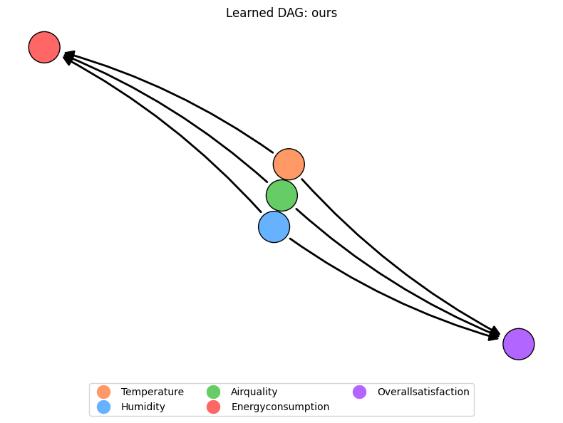

# Machine Causation in Smart Environments

👋 Welcome! This project explores how AI can discover **causal relationships** in smart rooms — like how temperature, humidity, and air quality affect energy use and human comfort.

We combine:
- 📊 Traditional Causal Discovery Methods (PC, SAM)
- 🧠 Large Language Models (LLMs like GPT-4)
- 🏗️ Physics-based Simulations (EnergyPlus + thermal comfort models)

## 🔍 Project Goal
Enable smarter building automation by identifying *true cause-effect relationships*, not just correlations. This helps reduce energy consumption while improving occupant satisfaction.

---

## 🏗️ System Overview

Our system works in four stages:
1. **Hypothesis Generation**  
   Using PC, SAM, and GPT-based prompts to suggest potential causal edges.
2. **Intervention Testing**  
   Simulate controlled changes in variables using a smart room simulation built on EnergyPlus.
3. **Model Refinement**  
   Iteratively validate or reject edges using empirical evidence.
4. **Final Causal Graph**  
   A high-confidence model of how the environment behaves.

  

---

## 🎮 Try It On Rutgers Day!
We created a simple "Guess the Cause" game to show how causal AI works in action.
Stop by and see if you can outsmart our model!

---

## 🧠 Want to Learn More?

- 📄 [Read our paper](link-to-pdf-or-publication)
- 💻 Built with Python, causal-learn, and EnergyPlus
- 🏛️ Developed at Rutgers University, ECE Department

📬 Contact: [taqiya.ehsan@rutgers.edu](mailto:taqiya.ehsan@rutgers.edu)
